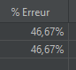

# How a bug in libseccomp affected a stress test of a Symfony application

## Context

For a while, I'm working on a small experiment about PHP, Nginx and Symfony. More precisely, I want to push as far as possible
the optimization for the [Symfony demo application](https://github.com/symfony/demo).

I use [Apache Jmeter](https://jmeter.apache.org/) to run stress test on this application, which is hosted on my [Raspberry Pi 4 8G](https://www.raspberrypi.com/products/raspberry-pi-4-model-b/).

I use [Raspbian 10 Buster](https://www.raspberrypi.com/software/operating-systems/) as the OS for this machine.

```bash
bapt@raspberrypi:~ $ uname -a
Linux raspberrypi 5.10.103-v7l+ #1529 SMP Tue Mar 8 12:24:00 GMT 2022 armv7l GNU/Linux
```

I chose to run my software stack on [Docker](https://www.docker.com/). At the time, the aforementioned stack was composed of Nginx, PHP 8.2 fpm and Postgres.

Here is a sample of the `docker-compose.yaml` file used :

```yaml

version: '2'

services:
  opti-blog-php:
    build: './php'
    volumes:
      - ../demo:/app
      - ./php/custom.ini:/usr/local/etc/php/php.ini

  opti-blog-nginx:
    image: 'nginx:latest'
    depends_on:
      - opti-blog-php
    ports:
      - '8087:80'
      - '8088:443'
    volumes:
      - ./nginx/demo.conf:/etc/nginx/conf.d/default.conf
      - ./nginx/fastcgi.conf:/etc/nginx/fastcgi.conf
      - ./nginx/nginx.conf:/etc/nginx/nginx.conf
      - ../demo:/app
  opti-blog-database:
    image: 'postgres:14'
    restart: unless-stopped
    environment:
      POSTGRES_USER: demo
      POSTGRES_PASSWORD: demo
      POSTGRES_DB: demo
    ports:
      - '5432:5432'
```

## The bug

Right after launching the docker stack, I created a Jmeter test plan to try if everything is working.

The test case looked like that :

Very few clients..


And only a request on the first article of the blog


I hit the run button and... a lot of HTTP **504** errors.


Almost 50% failure rate


This was unexpected, because this is a very low load for a website. Even without any optimization It should not happen.


I checked the Nginx logs and noticed something

```log
docker-opti-blog-nginx-1     | 192.168.1.x - - [02/Jun/1970:00:40:48 +0000] "GET /fr/blog/posts/lorem-ipsum-dolor-sit-amet-consectetur-adipiscing-elit HTTP/1.1" 200 103149 "-" "Mozilla/5.0 (Windows NT 10.0; Win64; x64) AppleWebKit/537.36 (KHTML, like Gecko) Chrome/114.0.0.0 Safari/537.36" "-"
docker-opti-blog-nginx-1     | 192.168.1.x - - [01/Jun/1970:15:58:56 +0000] "GET /build/639.76194c5a.css HTTP/1.1" 304 0 "http://opti-blog.local:8087/fr/blog/posts/lorem-ipsum-dolor-sit-amet-consectetur-adipiscing-elit" "Mozilla/5.0 (Windows NT 10.0; Win64; x64) AppleWebKit/537.36 (KHTML, like Gecko) Chrome/114.0.0.0 Safari/537.36" "-"
docker-opti-blog-nginx-1     | 192.168.1.x - - [23/Dec/1972:17:18:56 +0000] "GET /build/runtime.5feae901.js HTTP/1.1" 304 0 "http://opti-blog.local:8087/fr/blog/posts/lorem-ipsum-dolor-sit-amet-consectetur-adipiscing-elit" "Mozilla/5.0 (Windows NT 10.0; Win64; x64) AppleWebKit/537.36 (KHTML, like Gecko) Chrome/114.0.0.0 Safari/537.36" "-"
docker-opti-blog-nginx-1     | 192.168.1.x - - [23/Dec/1972:17:18:56 +0000] "GET /build/41.64983f8e.js HTTP/1.1" 304 0 "http://opti-blog.local:8087/fr/blog/posts/lorem-ipsum-dolor-sit-amet-consectetur-adipiscing-elit" "Mozilla/5.0 (Windows NT 10.0; Win64; x64) AppleWebKit/537.36 (KHTML, like Gecko) Chrome/114.0.0.0 Safari/537.36" "-"
docker-opti-blog-nginx-1     | 192.168.1.x - - [23/Dec/1972:17:18:56 +0000] "GET /build/639.ac157402.js HTTP/1.1" 304 0 "http://opti-blog.local:8087/fr/blog/posts/lorem-ipsum-dolor-sit-amet-consectetur-adipiscing-elit" "Mozilla/5.0 (Windows NT 10.0; Win64; x64) AppleWebKit/537.36 (KHTML, like Gecko) Chrome/114.0.0.0 Safari/537.36" "-"
docker-opti-blog-nginx-1     | 192.168.1.x - - [23/Dec/1972:17:18:56 +0000] "GET /build/app.22ced1a0.js HTTP/1.1" 304 0 "http://opti-blog.local:8087/fr/blog/posts/lorem-ipsum-dolor-sit-amet-consectetur-adipiscing-elit" "Mozilla/5.0 (Windows NT 10.0; Win64; x64) AppleWebKit/537.36 (KHTML, like Gecko) Chrome/114.0.0.0 Safari/537.36" "-"
docker-opti-blog-nginx-1     | 192.168.1.x - - [23/Dec/1972:17:18:56 +0000] "GET /build/fonts/lato-normal.75614cfc.woff2 HTTP/1.1" 304 0 "http://opti-blog.local:8087/build/app.3a149582.css" "Mozilla/5.0 (Windows NT 10.0; Win64; x64) AppleWebKit/537.36 (KHTML, like Gecko) Chrome/114.0.0.0 Safari/537.36" "-"
docker-opti-blog-nginx-1     | 192.168.1.x - - [23/Dec/1972:17:18:56 +0000] "GET /build/fonts/lato-bold.21b3848a.woff2 HTTP/1.1" 304 0 "http://opti-blog.local:8087/build/app.3a149582.css" "Mozilla/5.0 (Windows NT 10.0; Win64; x64) AppleWebKit/537.36 (KHTML, like Gecko) Chrome/114.0.0.0 Safari/537.36" "-"
docker-opti-blog-nginx-1     | 192.168.1.x - - [23/Dec/1972:17:18:56 +0000] "GET /build/fonts/fa-solid-900.1551f4f6.woff2 HTTP/1.1" 304 0 "http://opti-blog.local:8087/build/639.76194c5a.css" "Mozilla/5.0 (Windows NT 10.0; Win64; x64) AppleWebKit/537.36 (KHTML, like Gecko) Chrome/114.0.0.0 Safari/537.36" "-"
docker-opti-blog-nginx-1     | 192.168.1.x - - [23/Dec/1972:17:18:56 +0000] "GET /build/fonts/lato-normal-italic.bb5de40e.woff2 HTTP/1.1" 304 0 "http://opti-blog.local:8087/build/app.3a149582.css" "Mozilla/5.0 (Windows NT 10.0; Win64; x64) AppleWebKit/537.36 (KHTML, like Gecko) Chrome/114.0.0.0 Safari/537.36" "-"
docker-opti-blog-nginx-1     | 192.168.1.x - - [23/Dec/1972:17:18:56 +0000] "GET /build/fonts/fa-brands-400.d878b0a6.woff2 HTTP/1.1" 304 0 "http://opti-blog.local:8087/build/639.76194c5a.css" "Mozilla/5.0 (Windows NT 10.0; Win64; x64) AppleWebKit/537.36 (KHTML, like Gecko) Chrome/114.0.0.0 Safari/537.36" "-"
```

and

```log
docker-opti-blog-nginx-1     | 1970/02/23 06:49:15 [error] 24#24: *90 upstream timed out (110: Connection timed out) while reading response header from upstream, client: 192.168.1.x, server: opti-blog.local, request: "GET /fr/blog/posts/lorem-ipsum-dolor-sit-amet-consectetur-adipiscing-elit HTTP/1.1", upstream: "fastcgi://172.18.0.2:9000", host: "opti-blog.local:8087"
docker-opti-blog-nginx-1     | 192.168.1.x - - [23/Feb/1970:06:49:15 +0000] "GET /fr/blog/posts/lorem-ipsum-dolor-sit-amet-consectetur-adipiscing-elit HTTP/1.1" 504 160 "-" "Apache-HttpClient/4.5.13 (Java/11.0.8)" "-"
```

The time of these logs is clearly suspicious… I mean, 1970 ?

During the installation of Docker on my raspberry, I have read something about "clock error" due to a new linux kernel version (v5 instead of v4) used in bullseye distros

[Github comment about that](https://github.com/debuerreotype/docker-debian-artifacts/issues/106)

And obviously, my Nginx image was based on Bullseye.

## What happened 
My guess is that the time in the container is erratic and Nginx is getting wrong dates between two time measurements. 

The error was not few hours late, but years.

I think that when Nginx gets the date the first time for a request, it got a date in 1970 and then, 
when it tried to detect if the request last too much (i.e. is in timeout),
it got a date in 1972 or in 1986.

Thus trigger the timeout limit for the request, and we get an HTTP 504 error…

## Solution

Thanks to [this issue](https://github.com/nginxinc/docker-nginx/issues/601#issuecomment-971609391), I managed to find a solution.

We have to install a newer version of `libseccomp`,
because the current version 2.3.3-4 (that is installed on my raspberry) seems bugged. 

Unfortunately, I cannot find a newer version on my repo (because I'm using Raspbian 10), so I had to add **buster-backpot** in my repo list. 

Then : 

```bash
apt-update && apt-get -y install libseccomp2/buster-backports
```

Finally, I restarted my containers and voilà :

```log
docker-opti-blog-nginx-1     | 2023/06/12 12:58:34 [notice] 1#1: start worker process 28
docker-opti-blog-nginx-1     | 2023/06/12 12:58:34 [notice] 1#1: start worker process 29
docker-opti-blog-nginx-1     | 2023/06/12 12:58:34 [notice] 1#1: start worker process 30
docker-opti-blog-nginx-1     | 2023/06/12 12:58:34 [notice] 1#1: start worker process 31
```

The time is correct !

And no error since


```log
docker-opti-blog-nginx-1     | 192.168.1.x - - [12/Jun/2023:12:59:17 +0000] "GET /fr/blog/posts/lorem-ipsum-dolor-sit-amet-consectetur-adipiscing-elit HTTP/1.1" 200  32495 "-" "Apache-HttpClient/4.5.13 (Java/11.0.8)" "-"
```